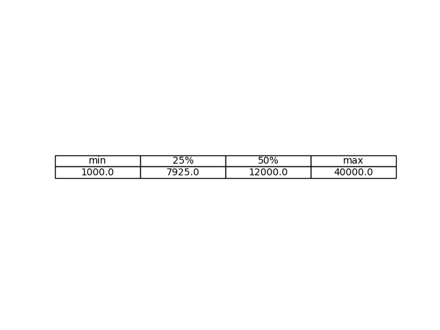
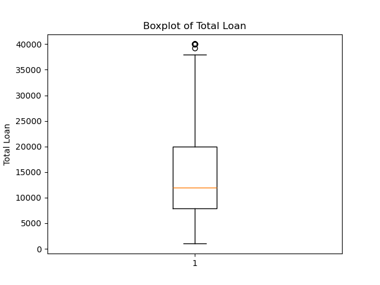
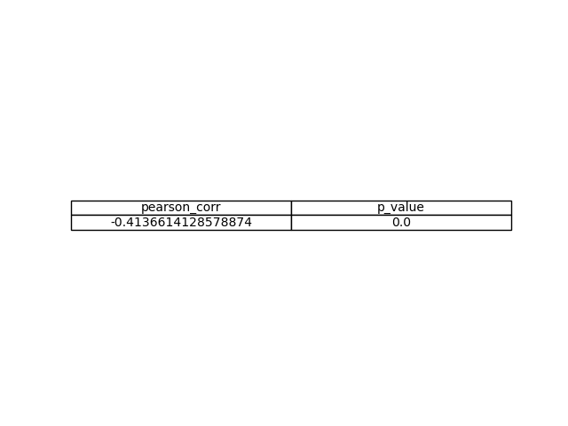
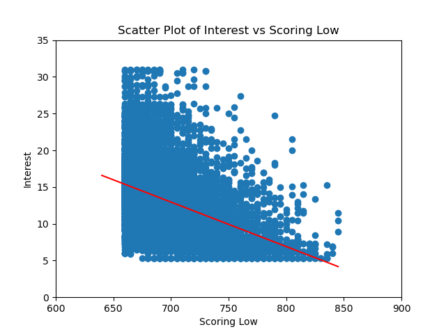
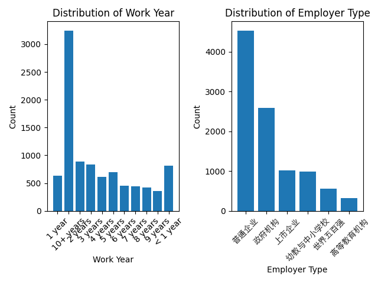
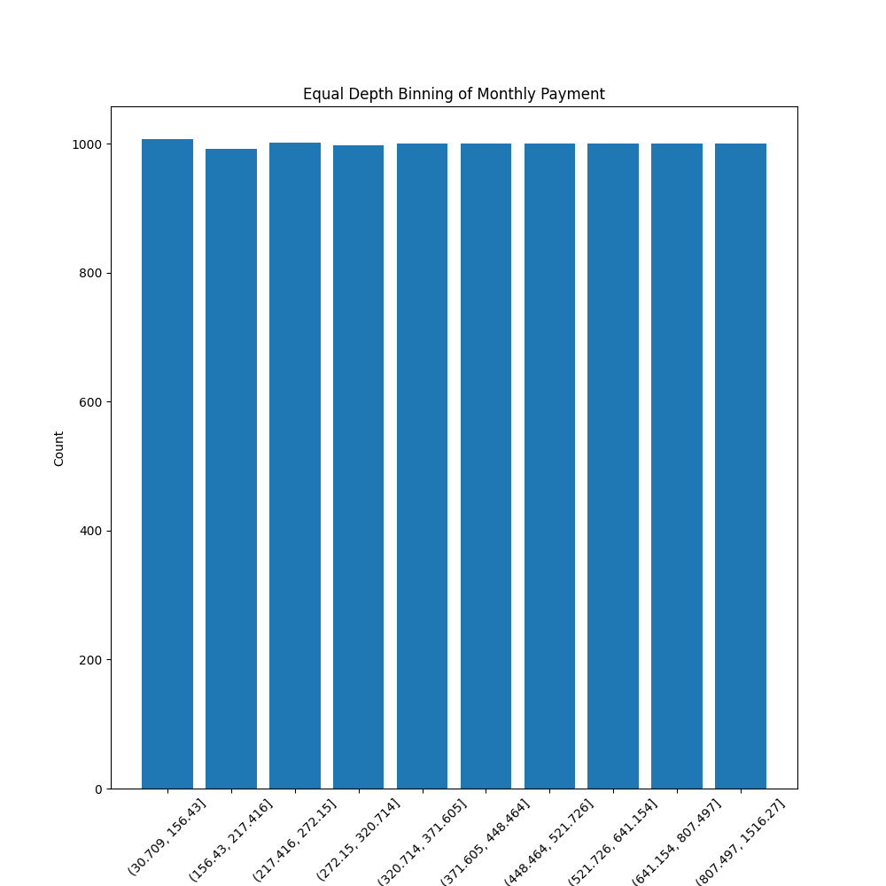
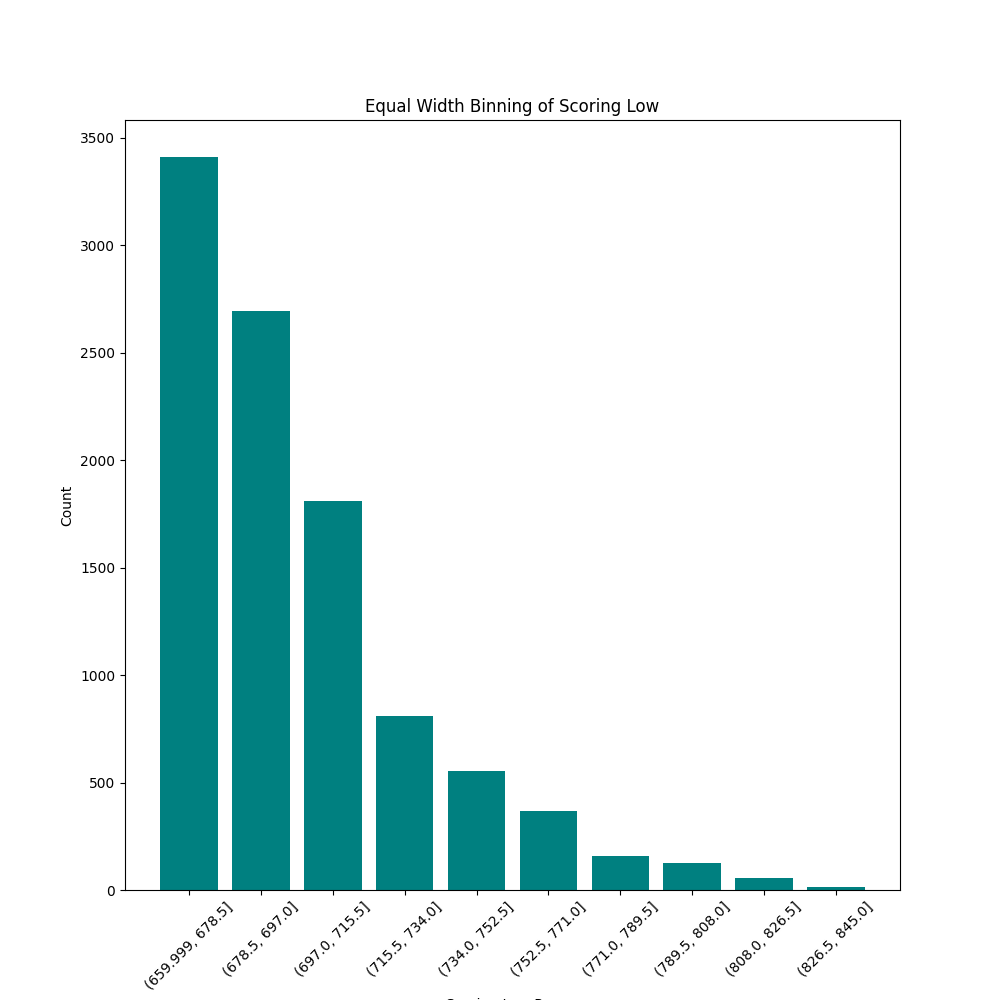

## Homework 1

### 一、数据属性练习

1. total_loan: Ratio，有明确零点，比例有意义。
2. year_of_loan: Interval，零点不绝对，比例计算无意义。
3. grade: Ordinal，有序，但是间隔无意义，不能计算。
4. loan_id: Nominal，无序，仅用于区分，不能计算。

### 二、计算统计信息

1. total_loan 存在缺失值。

2. 五数概括 

盒图 

3. 存在相关性

计算相关系数有



绘出图像有



可见interest和scoring_low有显著相关性。

### 三、数据预处理与可视化

1. 

2. 

3. 

### 四、文本数据的表示

#### 1. 实现思路

1. 数据预处理

对每篇文章，分割出`words`，然后统计这篇文章中的词频，同时更新所有文章中的单词出现次数

```python
for file in os.listdir(dir):
    path = os.path.join(dir, file)
    with open(path, 'r') as file:
        doc_cnt+=1
        words=file.read().split()
        doc_freqs.append(Counter(words))                
        for word in set(words):
            if word in word_freqs:
                word_freqs[word]+=1
            else:
                word_freqs[word]=1
```

2. tif-dif向量的构建

对每篇文章，对其中的每一个单词按公式计算，tf=文章中的相对词频，idf=在所有文章中出现相对频率的倒数，tf-idf=tf*idf。

```python
for freqs in doc_freqs:
    tfidf_vec=np.zeros(len(vocab))
    for word, freq in freqs.items():
        tf=freq/sum(freqs.values())
        idf=math.log(doc_cnt/(1+word_freqs[word]))
        tfidf_vec[vocab[word]]=tf*idf
    tfidf_vecs.append(tfidf_vec)
```

3. cooc-matrix的构建

对每篇文章中的所有词汇构成的对，更新共现矩阵的相应项。

```python
for file in os.listdir(dir):
    path = os.path.join(dir, file)
    with open(path, 'r') as file:
        words=set(file.read().split())
        for word1 in words:
            idx1=vocab[word1]
            for word2 in words:
                idx2=vocab[word2]
                cooc_matrix[idx1][idx2]+=1
```

#### 2. 实验结果

见文件`task4.txt`

```bash
与文档0欧式距离最近的5篇文档: [(121, np.float64(0.23062602690116157)), (207, np.float64(0.23574787053172966)), (69, np.float64(0.24231358224957195)), (290, np.float64(0.243063775856435)), (17, np.float64(0.2444154342744022))]
与文档0余弦相似度最高的5篇文档: [(121, np.float64(0.2840015829746121)), (72, np.float64(0.06867590393920309)), (60, np.float64(0.06865390870572617)), (45, np.float64(0.06421409112035384)), (7, np.float64(0.058685537471856106))]
与单词news欧式距离最近的5个词: [('conference', np.float64(53.86093203798092)), ('until', np.float64(63.94528911499267)), ('won', np.float64(65.39877674696982)), ('games', np.float64(66.09084656743322)), ('week,', np.float64(66.84309986827361))]
与单词news余弦相似度最高的5个词: [('conference', np.float64(0.8927331767072176)), ('against', np.float64(0.8489674375132426)), ('when', np.float64(0.8425711524875884)), ('said', np.float64(0.84223467892122)), ('said.', np.float64(0.8417682737488176))]
```

#### 3. 分析

1. 我们可以注意到欧式距离意义下的相似与余弦相似意义下的部分一致。具体区别可以归结于以下原因：

    (1) 欧式距离与向量本身的大小有关，因此如果两个向量都非常小，那么他们的欧式距离也会很小；

    (2) 余弦距离只与角度有关，因此两个向量只要夹角小就会表现为距离较近。

我尝试了通过内积作为距离的表征，但是得到的结果与欧式距离和余弦相似相距甚远，这表明欧式距离盒余弦相似应该是比较合理的。

2. 文档相似分析

综合欧式距离和余弦相似，我们认为与文档0最相似的文章为121。

文档0主要涉及一起雕塑被盗的案件，涉及警方调查、失窃事件、历史背景等。文档121涉及警方处理一起纵火和伤害事件，同样是警方调查相关内容。两者具有以下共同点：警方介入、犯罪事件、调查过程，这可能是它们在向量空间中接近的原因。当然，两篇文章也具有许多不同点：文档0更偏向文化损失，而文档121更偏向暴力犯罪。不过，考虑到我们简陋的模型与有限的文本范围，这二者的相似性完全可以接受。

3. 词汇相似分析

综合欧式距离和余弦相似，我们认为与单词news最相似的单词是conference。这个事实可以解释为news一次通常出现于news conference (新闻发布会)。其他相似的词包括against, when, until等虚词，有趣的是'said'和'said.'都在余弦相似的意义上成为了与news相似的前五名。