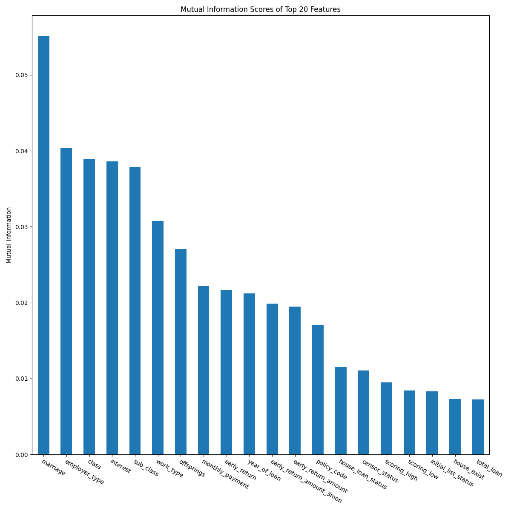

### Howework #2

#### 1. 分类算法

##### 1.1 

$\color{Blue}{Answer:}$



##### 1.2 

$\color{Blue}{Answer:}$

```bash
Model: Decision Tree
Fold 1: AUC = 0.6583
Fold 2: AUC = 0.6532
Fold 3: AUC = 0.6569
Fold 4: AUC = 0.6540
Fold 5: AUC = 0.6527
Average AUC: 0.6550

Model: Naive Bayes
Fold 1: AUC = 0.7729
Fold 2: AUC = 0.7766
Fold 3: AUC = 0.7761
Fold 4: AUC = 0.7753
Fold 5: AUC = 0.7710
Average AUC: 0.7744

Model: AdaBoost
Fold 1: AUC = 0.8315
Fold 2: AUC = 0.8354
Fold 3: AUC = 0.8396
Fold 4: AUC = 0.8341
Fold 5: AUC = 0.8335
Average AUC: 0.8348
```

##### 1.3

$\color{Blue}{Answer:}$

比较三种算法的结果知 AdaBoost 是最适合本数据集的算法.

#### 2. 聚类算法

##### 2.1

计算每个点到 $C_1$ 和 $C_2$ 的距离，然后归类到最近的中心。

| 点 | 到 $C_1 = (2,4)$ 的距离 | 到 $C_2 = (7,6)$ 的距离 | 归类到哪类 |
| --- | --- | --- | --- |
| P1 | $\sqrt 1 = 1$ | $\sqrt 37$| 1 |
| P2 | $\sqrt 1 = 1$ | $\sqrt 29$ | 1 |
| P3 | $\sqrt 2$ | $\sqrt 25$ | 1 |
| P4 | $\sqrt 4$ | $\sqrt 13$ | 1 |
| P5 | $\sqrt 1$ | $\sqrt 34$ | 1 |
| P6 | $\sqrt 5$ | $\sqrt 29$ | 1 |
| P7 | $\sqrt 32$ | $\sqrt 1$ | 2 |
| P8 | $\sqrt 26$ | $\sqrt 1$ | 2 |
| P9 | $\sqrt 17$ | $\sqrt 5$ | 2 |
| P10 | $\sqrt 40$ | $\sqrt 1$ | 2 |
| P11 | $\sqrt 41$ | $\sqrt 1$ | 2 |
| P12 | $\sqrt 41$ | $\sqrt 1$ | 2 |

**Step 2：更新中心点**

- 类 C1 

$$x_{C1} = \frac{1+2+3+4+2+3}{6} = \frac{15}{6} = 2.5$$
$$y_{C1} = \frac{4+5+3+4+3+2}{6} = \frac{21}{6} = 3.5$$

新 $C_1 = (2.5, 3.5)$

- 类 C2
$$x_{C2} = \frac{6+7+6+8+7+8}{6} = \frac{42}{6} = 7$$
$$y_{C2} = \frac{6+5+4+6+7+5}{6} = \frac{33}{6} = 5.5$$

新 $C_2 = (7, 5.5)$

**Step 3：再次分配**

| 点 | 到 $C_1 = (2,4)$ 的距离 | 到 $C_2 = (7,6)$ 的距离 | 归类到哪类 |
| --- | --- | --- | --- |
| P1 | $\sqrt 2.5 = 1$ | $\sqrt 37.25$| 1 |
| P2 | $\sqrt 2.5 = 1$ | $\sqrt 29.25$ | 1 |
| P3 | $\sqrt 0.5$ | $\sqrt 25.25$ | 1 |
| P4 | $\sqrt 2.5$ | $\sqrt 13.25$ | 1 |
| P5 | $\sqrt 2.5$ | $\sqrt 34.25$ | 1 |
| P6 | $\sqrt 2.5$ | $\sqrt 29.25$ | 1 |
| P7 | $\sqrt 20.5$ | $\sqrt 2.25$ | 2 |
| P8 | $\sqrt 26.5$ | $\sqrt 0.25$ | 2 |
| P9 | $\sqrt 12.5$ | $\sqrt 5.25$ | 2 |
| P10 | $\sqrt 33.5$ | $\sqrt 1.25$ | 2 |
| P11 | $\sqrt 36.5$ | $\sqrt 2.25$ | 2 |
| P12 | $\sqrt 36.5$ | $\sqrt 0.25$ | 2 |

分配与上一次一致，**聚类收敛**。

**最终结果**

- **类 C1（中心为 (2.5, 3.5)）：**
  P1 (1,4), P2 (2,5), P3 (3,3), P4 (4,4), P5 (2,3), P6 (3,2)

- **类 C2（中心为 (7, 5.5)）：**
  P7 (6,6), P8 (7,5), P9 (6,4), P10 (8,6), P11 (7,7), P12 (8,5)

##### 2.2 

$\color{Blue}{Answer:}$

实验结果如下：

```bash
k=2
cluster 0's keywords
username, url, via, youtube, new, music, video, news, trump, check
cluster 1's keywords
username, url, love, time, get, new, one, day, game, please

k=3
cluster 0's keywords
username, url, new, music, via, thanks, video, game, latest, live
cluster 1's keywords
love, day, happy, username, url, new, year, thank, much, today
cluster 2's keywords
url, via, username, new, youtube, news, music, video, get, trump

k=4
cluster 0's keywords
username, url, thanks, latest, new, music, game, show, badge, night
cluster 1's keywords
love, happy, day, username, url, new, year, thank, much, today
cluster 2's keywords
username, url, new, get, time, game, one, please, like, see
cluster 3's keywords
via, url, youtube, video, music, username, trump, news, new, official
```

###### 1. K=2 的聚类分析

**Cluster 0:**

- 关键词：`username, url, via, youtube, new, music, video, news, trump, check`

- 结论：偏向信息发布如新闻（news, trump），视频（youtube, music, video）。出现 via 表示转载，常见于内容型发布与转载，如推送新视频、新歌、新闻等。

**Cluster 1:**

- 关键词：`username, url, love, time, get, new, one, day, game, please`

- 结论：偏向用户互动：比如 love, please, day。可能和用户生活状态或日常感受有关。

**结论**：

K=2 时，将语料大致分为：内容型传播型与用户互动型。

###### 2. K=3 的聚类分析

**Cluster 0:**

- 关键词：`username, url, new, music, via, thanks, video, game, latest, live`

- 特征：似乎是与媒体、娱乐内容相关，如音乐、视频、游戏等内容。

**Cluster 1:**

- 关键词：`love, day, happy, username, url, new, year, thank, much, today`

- 特征：感觉是明显的节日类内容，有典型的祝福词汇（happy, new year, thank you, love）。

**Cluster 2:**

- 关键词：`url, via, username, new, youtube, news, music, video, get, trump`

- 特征：聚焦于新闻内容，比较政治、正式（trump, news, youtube）。

**结论**：
K=3 时细化成：

1. 娱乐、媒体内容；
2. 节日相关内容；
3. 新闻/政治类内容。

###### 3. K=4 的聚类分析

**Cluster 0:**

- 关键词：`username, url, thanks, latest, new, music, game, show, badge, night`

- 特征：与娱乐、游戏内容相关。thanks, night 等也暗示可能与活动相关。

**Cluster 1:**

- 关键词：`love, happy, day, username, url, new, year, thank, much, today`

- 特征：与 K=3 的 Cluster 1 类似，也感觉是明显的节日类内容。

**Cluster 2:**

- 关键词：`username, url, new, get, time, game, one, please, like, see`

- 特征：似乎是更加日常的娱乐内容，带有请求或互动语气（please, like, see）。

**Cluster 3:**

- 关键词：`via, url, youtube, video, music, username, trump, news, new, official`

- 特征：聚焦于新闻内容，更加政治、正式（trump, news, official）。

**结论**：
K=4 时，聚类进一步细分为：

1. 与活动相关的娱乐内容
2. 节日类内容
3. 日常型的娱乐内容
4. 新闻/政治类内容

**注：**

算法思路在附录中代码处。

<div STYLE="page-break-after: always;"></div>

$\color{Blue}{Code:}$

第一题：

$\color{Red}{实现思路:}$

首先进行数据预处理：将数值型数据进行平均值填充，将非数值型数据进行众数填充，然后将非数值型数据进行编码，方便后续处理；

然后计算互信息，挑选出前20的信息，绘制出相应的信息；

选取排名前20的信息进行5折交叉验证，计算AUC。

```python
import numpy as np
import pandas as pd
from pandas.core.series import Series
from pandas.core.frame import DataFrame
import matplotlib.pyplot as plt

from sklearn.impute import SimpleImputer
from sklearn.feature_selection import mutual_info_classif
from sklearn.model_selection import StratifiedKFold
from sklearn.metrics import roc_auc_score

from sklearn.tree import DecisionTreeClassifier
from sklearn.naive_bayes import GaussianNB
from sklearn.ensemble import AdaBoostClassifier
from sklearn.preprocessing import LabelEncoder

def preprocess(df:DataFrame) -> None:
    num_cols = df.select_dtypes(include=[np.number]).columns
    cat_cols = df.select_dtypes(exclude=[np.number]).columns

    df[num_cols] = SimpleImputer(strategy='mean').fit_transform(df[num_cols])
    df[cat_cols] = SimpleImputer(strategy='most_frequent').fit_transform(df[cat_cols])
    
    for col in cat_cols:
        df[col] = LabelEncoder().fit_transform(df[col])

def calc_mi(X:DataFrame, y:Series) -> Series:
    mi_scores = mutual_info_classif(X, y, discrete_features='auto')
    mi_scores = pd.Series(mi_scores, index=X.columns).sort_values(ascending=False)
    return mi_scores

def plot(scores:Series, features:list[str]) -> None:
    plt.figure(figsize=(12, 12))
    scores[features].plot(kind='bar')
    plt.title("Mutual Information Scores of Top 20 Features")
    plt.ylabel("Mutual Information")
    plt.xticks(rotation=330, ha='left', rotation_mode='anchor')
    plt.tight_layout()
    plt.savefig("task1.1_mutual_info.png")

def train(model, model_name:str, X:np.ndarray, y:Series, skf) -> None:
    print(f"Model: {model_name}")
    
    auc_scores = []

    for fold, (train_idx, val_idx) in enumerate(skf.split(X, y)):
        X_train, X_val = X[train_idx], X[val_idx]
        y_train, y_val = y[train_idx], y[val_idx]
        model.fit(X_train, y_train)
        
        y_prob = model.predict_proba(X_val)[:, 1]
        auc = roc_auc_score(y_val, y_prob)
        auc_scores.append(auc)
        print(f"Fold {fold}: AUC = {auc}")

    print(f"Average AUC: {np.mean(auc_scores)}\n")

def main():
    df = pd.read_csv('train_100000.csv')
    preprocess(df)
    
    X = df.drop(columns=['is_default'])
    y = df['is_default']
    mi_scores = calc_mi(X, y)
    top20_features = mi_scores.head(20).index.tolist()

    plot(mi_scores, top20_features)

    models = {
        'Decision Tree': DecisionTreeClassifier(),
        'Naive Bayes': GaussianNB(),
        'AdaBoost': AdaBoostClassifier(),
    }

    skf = StratifiedKFold(n_splits=5, shuffle=True, random_state=42)
    X_selected = df[top20_features].values

    for model_name, model in models.items():
        train(model, model_name, X_selected, y, skf)

if __name__ == "__main__":
    main()
```

<div STYLE="page-break-after: always;"></div>

第二题

$\color{Red}{实现思路:}$

1. 首先进行数据预处理，全部转换为小写字母，然后删除所有的标点符号，最后删除停用词；

2. 按照 tf-idf 算法将所有篇章矢量化；

3. 用 KMeans 算法进行聚类；

4. 找到每个聚类的中心矢量，根据前10个最大的分量找到每类的关键词。

```python
from sklearn.feature_extraction.text import TfidfVectorizer
from sklearn.cluster import KMeans
import nltk
from nltk.corpus import stopwords
from string import punctuation

def preprocess(text:str, stop_words:set) -> str:
    text = text.lower()
    text = text.translate(str.maketrans('', '', punctuation))
    words = text.split()
    words = [word for word in words if word not in stop_words]
    return ' '.join(words)

def tf_idf_vectorize(texts:list[str]) -> tuple:
    vectorizer = TfidfVectorizer()
    return vectorizer.fit_transform(texts), vectorizer.get_feature_names_out()

def k_means(k:int, vectors, terms) -> None:
    print(f"k={k}")
    
    kmeans = KMeans(n_clusters=k, random_state=42)
    kmeans.fit(vectors)
    centers = kmeans.cluster_centers_.argsort()[:, ::-1]
    
    for i in range(k):
        print(f"cluster {i}'s keywords")
        keywords = [terms[ind] for ind in centers[i, :10]]
        print(", ".join(keywords))
    print("")

def main():
    nltk.download('stopwords')
    stop_words = set(stopwords.words('english'))

    with open('twitter.txt', 'r') as f:
        tweets = [line.strip() for line in f if line.strip()]
    
    tweets = [preprocess(tweet, stop_words) for tweet in tweets]

    tweets_vectorized, terms = tf_idf_vectorize(tweets)

    for k in [2, 3, 4]:
        k_means(k, tweets_vectorized, terms)

if __name__ == "__main__":
    main()
```